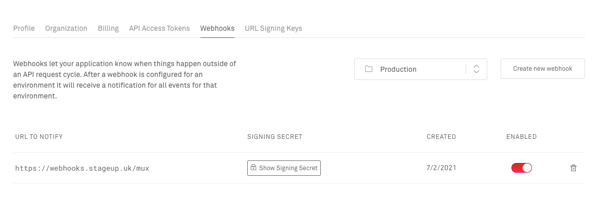

# Webhooks &nbsp;<a href="https://console.firebase.google.com/project/core-314910/overview"></a>


Fan-out webhooks to feature deployed branches - since we can't make webhooks on-the-fly for endpoints.
See <https://github.com/muxinc/mux-node-sdk/issues/12>

Makes no attempt to re-try requests, if a down-stream site fails, then tough luck.

```
                      +---------------+  Register/destroy the domain
mux.com  stripe.com   | Github Action |  POST   /endpoints?url=...&api_key=...
  |         |         +---------------+  DELETE /endpoints?url=...&api_key=...
  |         |               |
  v         v               v
+----------------------------------+      /-----------\
| webhooks.stageup.uk/(mux|stripe) + <--> | Firestore |
+----------------------------------+      \-----------/
        |       |       |               Look-up where to fan
        v       v       v               out webhooks to
    su-345  su-145  su-778.stageup.uk
```

Has support for:

- [x] Mux
- [ ] Stripe (can use Terraform for this)

---

## Installation

```shell
# installing firebase & all dependencies
$ npm install firebase -g
$ npm install --force
$ firebase login

# setting the api key
$ firebase functions:config:set webhooks.api_key="API_KEY_HERE"
✔  Functions config updated.

Please deploy your functions for the change to take effect by running firebase deploy --only functions

# check that the key was set
$ firebase functions:config:get
{
  "webhooks": {
    "api_key": "API_KEY_HERE"
  }
}
```

### MUX

Add entry to <https://dashboard.mux.com/organizations/2p9g5i/settings/webhooks> for the endpoint `address/mux`, like this:



## API

- **GET** `/endpoints`: Return all current endpoints
- **POST** `/endpoints`: Add a URL to the fan-out list
  - `?url`: url to add to fan-out list, e.g. `https://su-134.stageup.uk`
  - `?api_key`: known shared key for authenticating requests
- **DELETE** `/endpoints`: Remove a URL from the fan-out list
  - `?url`: url to add to fan-out list, e.g. `https://su-134.stageup.uk`
  - `?api_key`: known shared key for authenticating requests
- **POST** `/mux`: Endpoint for MUX to send webhooks to for them to be forwarded to known endpoints
- **POST** `/stripe`: Not yet implemented

## Contributing

Start Firebase development emulation server & compliation watcher:

```
npm run start
```

## Deploying

```
firebase deploy
```
